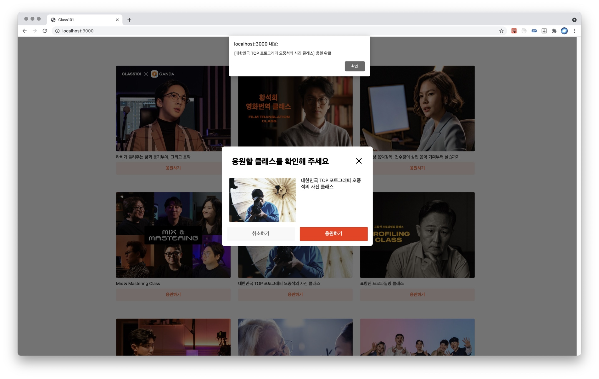
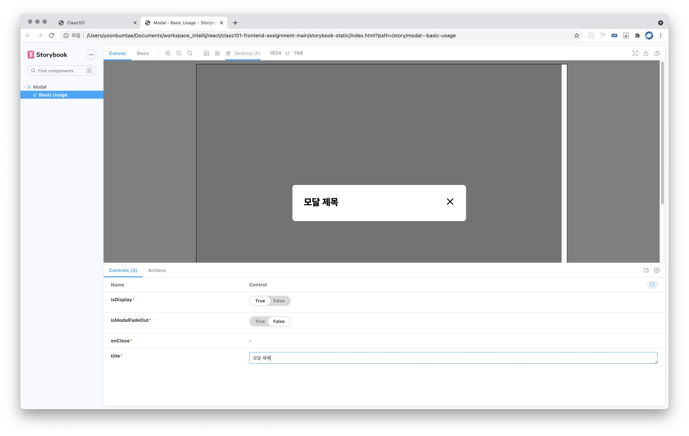
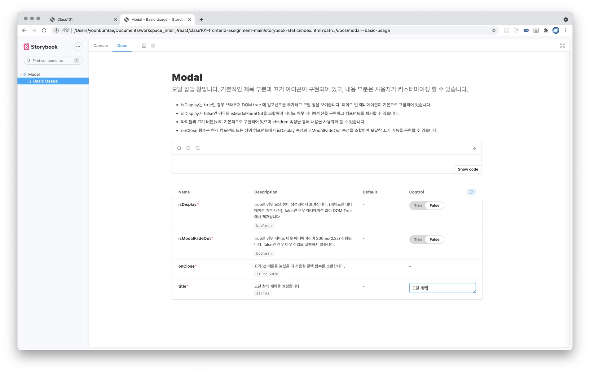
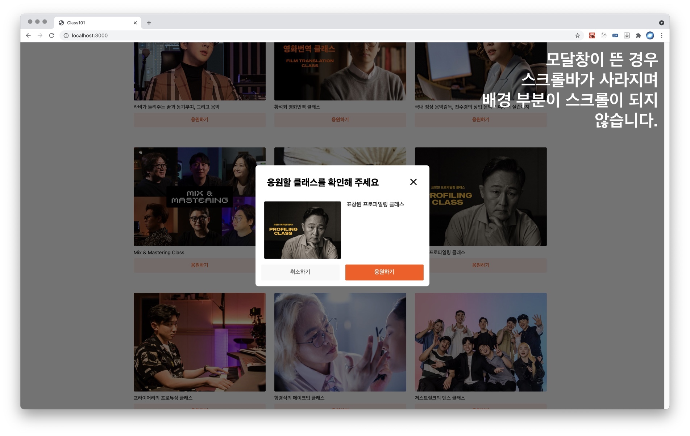
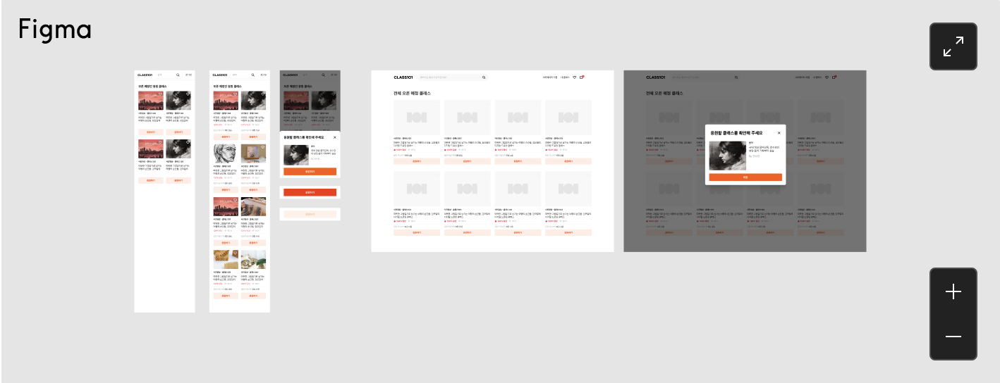

# Modal 윤범태
- 기본 요구사항 및 추가 요구사항을 주어진 조건 내에서 최대한 구현하였습니다.
- 템플릿 프로젝트에 맞춰 작업하였고 추가 라이브러리를 설치하지 않았습니다.
- 최초 템플릿 폴더가 git 프로젝트가 아니었기 때문에 버전 관리는 따로 수행하지 않았습니다.
- Modal 컴포넌트는 제목 부분과 닫기 버튼 부분(X)을 기본 제공하고, 내용 부분은 재사용성을 고려해 사용자화 할 수 있게 작성하였습니다.

## 설치 및 실행방법
아래 커맨드를 통해 디펜던시를 설치하고 실행합니다.
```
npm install
npm run dev
```

## 요구사항 구현 정도

### 디자인 시안 반영 방법
Figma로 제공된 시안과 동작 영상에서 보여지는 디자인이 다르기 때문에, Figma 시안을 우선으로 따르되 동작 영상과 다른 부분은 동작 영상의 디자인을 반영하였습니다.

### Viewport 너비에 따른 반응형 모달
뷰포트가 1024px 이상인 경우 팝업, 1023px 이하인 경우 바텀싯 형태로 나타나도록 하였습니다.


### `Modal` 컴포넌트 밖 / X 버튼 / 취소 버튼을 클릭했을 때 모달이 닫혀야 합니다.
모두 구현하였습니다. PC 버전에서 ESC 버튼을 눌렀을 때도 닫히도록 추가 구현하였습니다.

### `Modal` 컴포넌트 내에서 응원하기 버튼을 클릭하면 `"[상품 이름] 응원 완료"` 메시지를 표시한 뒤 모달이 닫혀야 합니다.
메시지가 표시되도록 구현하였습니다.


### 적절한 애니메이션 사용
모달창이 나타날 때, 사라질 때 페이드인/페이드아웃 애니메이션이 0.2초 진행되도록 하였습니다.

### `z-index`를 사용하지 않고 구현
`z-index`를 사용하지 않았습니다.

### `useProductList`에서 `loading`이 유의미하게 동작하도록 구현
이 부분은 `useProductList`를 변경하지는 않고 `CheerUpProductList`에서 `loading`이 `false`일 때만 아이템 리스트를 렌더링 하도록 하였습니다.

### 스토리북을 사용한 컴포넌트 문서화
아래와 같이 문서화 하였습니다. 또한 `storybook-static` 폴더에 문서화된 스토리북 페이지를 생성하였습니다.



### 모달이 보이지 않는 상태일 때, DOM에 랜더링 되지 않도록 구현
최초 리스트에서 응원하기 버튼을 클릭하지 않은 경우, 모달의 `div` 부분이 렌더링되지 않도록 하였습니다.

### 모달이 열린 상황에서 `body`가 스크롤이 되지 않도록 구현
스크롤 되지 않도록 구현하였습니다.



# 클래스101 프론트엔드 직군 사전 과제

클래스101의 프론트엔드 직군에 지원해주셔서 감사합니다. 클래스101에서는 직무 면접에서 지원자와 보다 심도있는 이야기를 나누기 위해 사전 과제 단계를 진행하고 있습니다.

사전 과제에서 구현해야 하는 것은 반응형 `Modal` 컴포넌트입니다. 아래 정의된 요구사항을 구현해 주시면 되고, 그 외 부분은 자유롭게 작업해 주시면 됩니다. 사전 과제는 [프로그래머스](https://programmers.co.kr/)를 통해 진행됩니다.

## 과제 세부사항

### 조건

- **주어진 템플릿 프로젝트를 사용하여 개발합니다.**
    - 템플릿 프로젝트에 설치되어 있지 않은 라이브러리는 사용하지 않습니다.
- 제한 시간 내에 요구사항을 모두 구현하는 것을 가장 중요하게 평가합니다.
- `Modal` 컴포넌트를 구현하는 선에서 요구사항은 자유롭게 변경 가능합니다.
    - 생각하시기에 더 나은 기획이 있다면 그에 따라 구현하시고 이유를 `README.md`에 작성 해주세요

### 요구사항

템플릿 프로젝트에는 상품 목록과 응원하기 버튼이 구현되어 있습니다. 아래 Figma를 참고하여 응원하기 버튼을 클릭했을 때 `Modal` 컴포넌트가 나타나도록 구현해주세요.

[](https://www.figma.com/file/48mkczhy5r7jyzZ0a4Vsqd/front-end-%EA%B3%BC%EC%A0%9C?node-id=0%3A1)

- [Figma로 제공되는 디자인 시안](https://www.figma.com/file/48mkczhy5r7jyzZ0a4Vsqd/front-end-%EA%B3%BC%EC%A0%9C?node-id=0%3A1)을 따라 구현해주세요.
    - Viewport 너비가 1024px 이상인 경우, `Modal` 컴포넌트를 Popup 형태로 표시합니다.
    - Viewport 너비가 1203px 이하인 경우, `Modal` 컴포넌트를 [BottomSheet](https://material.io/components/sheets-bottom) 형태로 표시합니다.
- `Modal` 컴포넌트 밖 / X 버튼 / 취소 버튼을 클릭했을 때 모달이 닫혀야 합니다.
- `Modal` 컴포넌트 내에서 응원하기 버튼을 클릭하면 `"[상품 이름] 응원 완료"` 메시지를 표시한 뒤 모달이 닫혀야 합니다.

아래 항목은 요구사항에 포함되지 않기 때문에 구현하지 않아도 괜찮으나, 지원자의 역량을 파악하기 위해 참고하는 항목입니다.

- 적절한 애니메이션 사용
- `z-index`를 사용하지 않고 구현
- `useProductList`에서 `loading`이 유의미하게 동작하도록 구현
- 스토리북을 사용한 컴포넌트 문서화
- 모달이 보이지 않는 상태일 때, DOM에 랜더링 되지 않도록 구현
- 모달이 열린 상황에서 `body`가 스크롤이 되지 않도록 구현

### 시안

`ModalBottomSheet` 컴포넌트를 실제 사용하는 모습은 다음과 같습니다.

- 데스크탑 영상
- 모바일 영상
